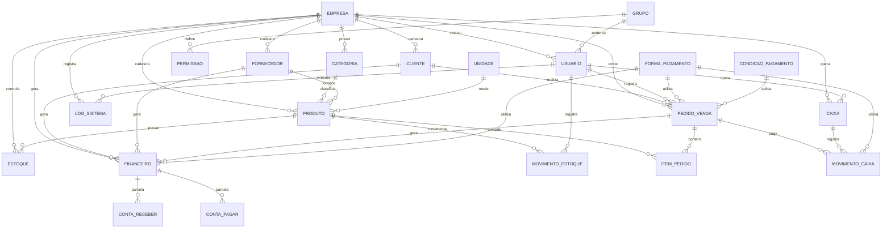

# ERP 2026 - Diagrama Entidade-Relacionamento

## Diagrama Textual (Mermaid)



## Tabelas e Relacionamentos

### Módulo Sistema
```
EMPRESA (1) ─── (N) USUARIO
EMPRESA (1) ─── (N) CONFIGURACAO
GRUPO   (1) ─── (N) USUARIO
GRUPO   (1) ─── (N) PERMISSAO
```

### Módulo Cadastros
```
EMPRESA    (1) ─── (N) CLIENTE
EMPRESA    (1) ─── (N) FORNECEDOR
EMPRESA    (1) ─── (N) PRODUTO
EMPRESA    (1) ─── (N) CATEGORIA
CATEGORIA  (1) ─── (N) PRODUTO
FORNECEDOR (1) ─── (N) PRODUTO
UNIDADE    (1) ─── (N) PRODUTO
```

### Módulo Estoque
```
EMPRESA (1) ─── (N) ESTOQUE
PRODUTO (1) ─── (1) ESTOQUE          [por empresa]
PRODUTO (1) ─── (N) MOVIMENTO_ESTOQUE
USUARIO (1) ─── (N) MOVIMENTO_ESTOQUE
```

### Módulo Vendas
```
CLIENTE      (1) ─── (N) PEDIDO_VENDA
USUARIO      (1) ─── (N) PEDIDO_VENDA
PEDIDO_VENDA (1) ─── (N) ITEM_PEDIDO
PRODUTO      (1) ─── (N) ITEM_PEDIDO
```

### Módulo Financeiro
```
FINANCEIRO (1) ─── (N) CONTA_RECEBER
FINANCEIRO (1) ─── (N) CONTA_PAGAR
CLIENTE    (1) ─── (N) FINANCEIRO [tipo R]
FORNECEDOR (1) ─── (N) FINANCEIRO [tipo P]
```

### Módulo Caixa
```
EMPRESA        (1) ─── (N) CAIXA
USUARIO        (1) ─── (N) CAIXA
CAIXA          (1) ─── (N) MOVIMENTO_CAIXA
FORMA_PAGAMENTO(1) ─── (N) MOVIMENTO_CAIXA
```

## Cardinalidades Especiais

| Tabela             | Constraint        | Descrição                          |
|-------------------|------------------|------------------------------------|
| ESTOQUE           | UQ(EMPRESA, PROD) | Um registro de estoque por produto |
| USUARIO           | UQ(LOGIN)          | Login único no sistema             |
| CONFIGURACAO      | UQ(EMPRESA, CHAVE) | Uma config por empresa/chave       |
| UNIDADE           | UQ(SIGLA)          | Sigla única                        |
